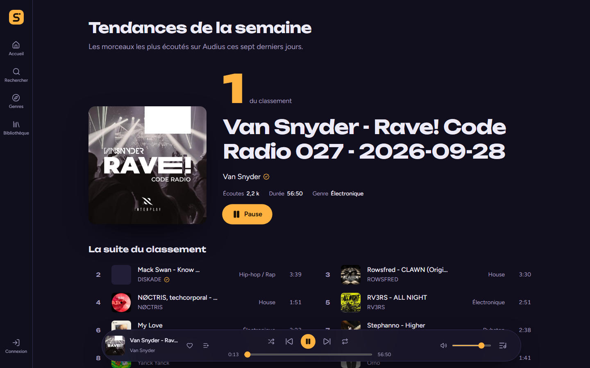
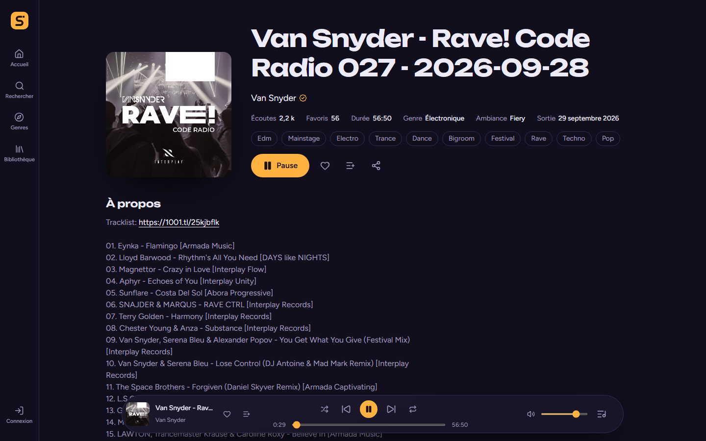
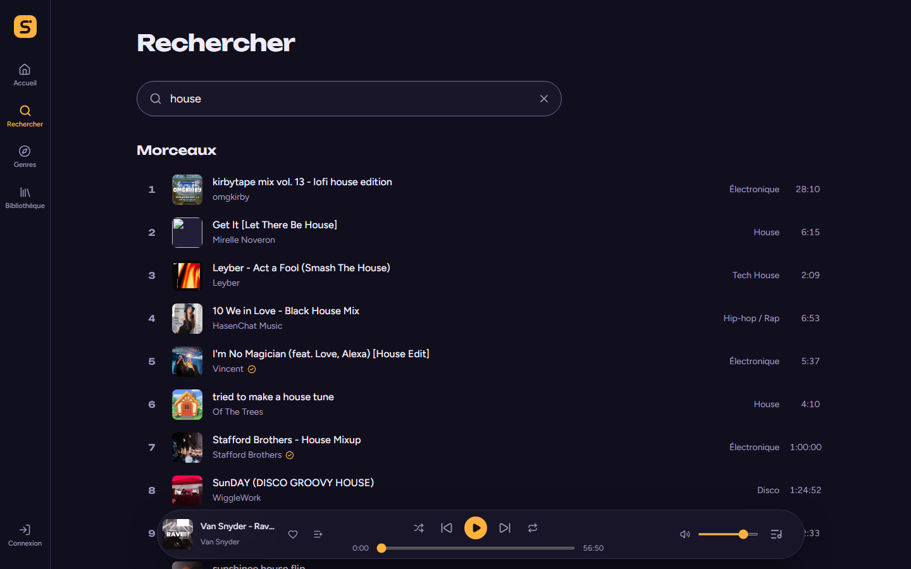
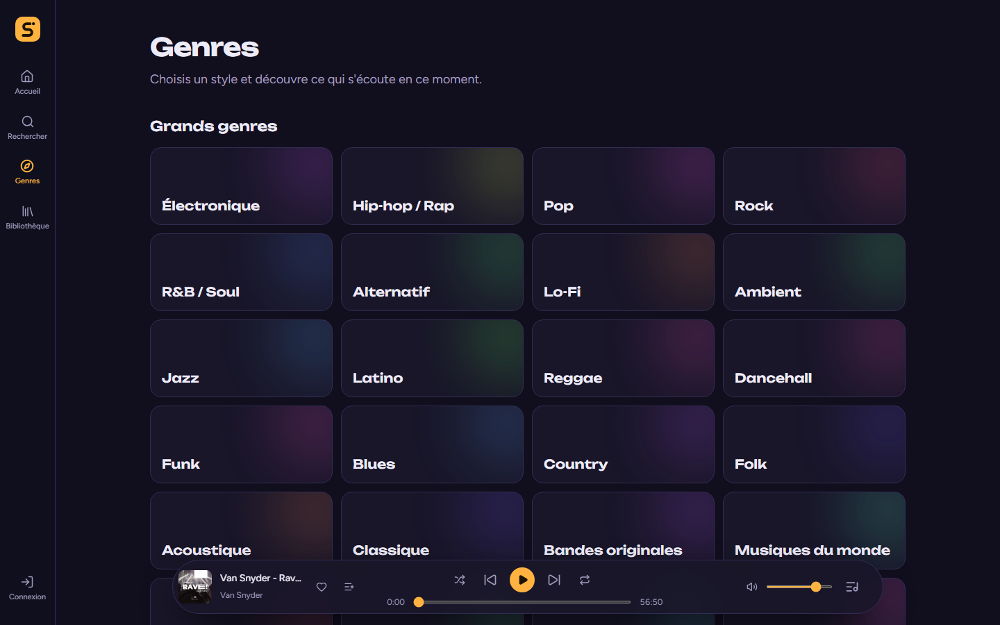
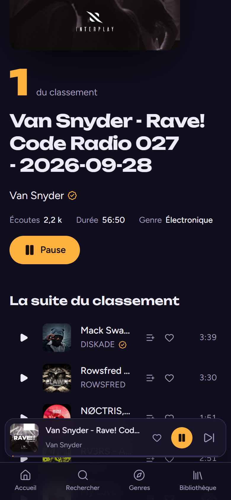
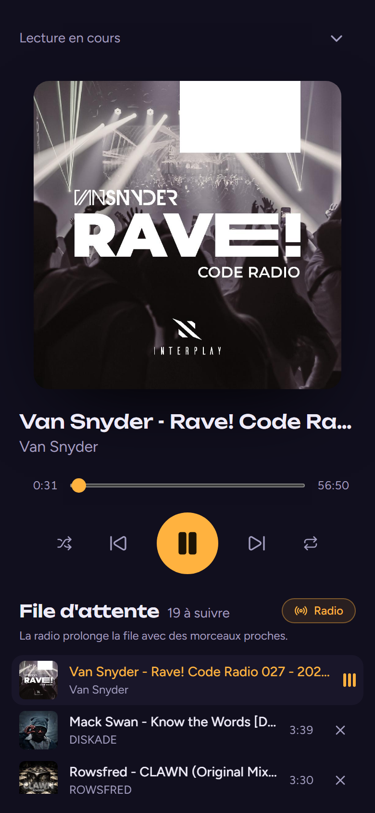
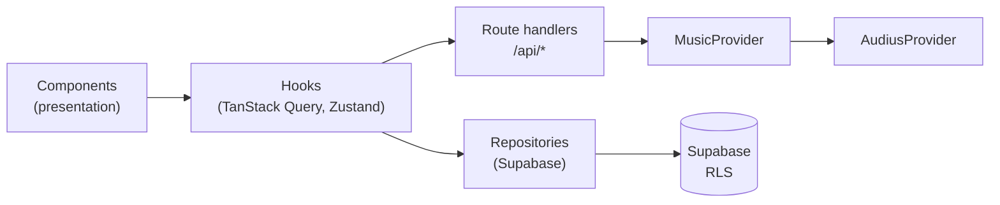

<div align="center">


# Soniva

**Discover music differently.**

A free music discovery and streaming web app built on the open [Audius](https://audius.co) catalogue.

[**Live demo →**](https://soniva-rho.vercel.app) &nbsp;·&nbsp;
[Features](#features) &nbsp;·&nbsp;
[Architecture](#architecture) &nbsp;·&nbsp;
[Getting started](#getting-started) &nbsp;·&nbsp;
[Roadmap](#roadmap)


</div>

---

## Preview



<table>
  <tr>
    <td width="50%"></td>
    <td width="50%"></td>
  </tr>
  <tr>
    <td align="center"><sub>Track page</sub></td>
    <td align="center"><sub>Instant search</sub></td>
  </tr>
</table>

<table>
  <tr>
    <td width="50%"></td>
    <td width="25%"></td>
    <td width="25%"></td>
  </tr>
  <tr>
    <td align="center"><sub>Genres</sub></td>
    <td align="center"><sub>Mobile</sub></td>
    <td align="center"><sub>Mobile player</sub></td>
  </tr>
</table>

> Screenshots are generated from the live site with `pnpm previews`.

## Why Soniva

Soniva is a portfolio project held to production standards: a real app with its own identity, not a streaming-service clone.

- **100% free, by design.** No paid API, no subscription, nothing that can bill automatically. Audius, Supabase (free plan) and Vercel (Hobby) only.
- **Discovery first.** Trends, genres, a radio that keeps the music going, and recommendations computed in the browser.
- **Private by default.** No ads, no analytics, no third-party trackers. Works without an account.

## Features

|                            |                                                                                                      |
| -------------------------- | ---------------------------------------------------------------------------------------------------- |
| 🎧 **Global player**       | Persistent across pages: queue, shuffle, repeat, seek, volume, lock-screen controls (Media Session). |
| 📻 **Radio**               | When the queue runs out, playback continues with similar tracks.                                     |
| 🔎 **Instant search**      | Tracks, artists and playlists as you type, with shareable server-rendered result URLs.               |
| 🧭 **Discovery**           | Weekly trends, 40+ genre pages, "For you" recommendations, new releases from followed artists.       |
| ❤️ **Library**             | Favourites, history, personal playlists and followed artists, with or without an account.            |
| 📊 **Your month in music** | Minutes listened, top artists and genre breakdown.                                                   |
| 🔐 **Accounts**            | Google or GitHub sign-in; the local library merges into the account on first sign-in.                |
| 🛡️ **Your data**           | One-click JSON export, device wipe and two-step account deletion (GDPR).                             |
| 🔍 **SEO**                 | Static public pages, metadata, Open Graph, JSON-LD, sitemap and robots.                              |

## Tech stack

| Area       | Tools                                                                                 |
| ---------- | ------------------------------------------------------------------------------------- |
| Framework  | Next.js (App Router, Server Components, Route Handlers) · React · TypeScript (strict) |
| Styling    | Tailwind CSS 4 · Unbounded & Figtree (self-hosted) · Lucide icons                     |
| Music data | Audius API, behind a replaceable `MusicProvider` interface                            |
| User data  | Supabase (Postgres + Auth, Paris region) with row-level security                      |
| State      | Zustand (player, library) · TanStack Query (remote data)                              |
| Validation | Zod (server)                                                                          |
| Testing    | Vitest · Testing Library · Playwright · axe-core                                      |
| Quality    | ESLint · Prettier · GitHub Actions                                                    |
| Hosting    | Vercel (Hobby plan, functions in Paris)                                               |

## Architecture



- **The provider is swappable.** The app only depends on `MusicProvider`; replacing Audius means writing another implementation.
- **Music data stays with the provider.** Supabase only stores user data: track and artist IDs, dates, playlists and listening stats.
- **Local first.** The library works without an account and merges into it on sign-in. Supabase is only loaded when a session exists.
- **Thin components.** Logic lives in hooks, pure functions (`lib/`) and services, which are unit-tested.

```
src/
├── app/          Routes, pages, metadata, route handlers
├── components/   Reusable UI and music components
├── features/     Domain modules (player, library, search, radio, stats, account…)
├── services/     External APIs (music provider, Supabase)
├── lib/          Pure, tested utilities
├── content/      Static copy (FAQ, legal facts, demo content)
├── config/       Site config, navigation, environment
└── types/        Domain types
e2e/              Playwright end-to-end and accessibility tests
supabase/         SQL migrations
```

## Quality

- **End-to-end:** 48 Playwright tests on desktop and mobile, against the production build.
- **Accessibility:** automated axe audit (WCAG 2.2 A/AA) on 13 pages, 24px touch targets, keyboard navigation, reduced-motion support, theme contrast of at least 6.2:1.
- **Lighthouse** (local production build, mobile): Performance 94 · Accessibility 100 · Best practices 100 · SEO 100.
- **Performance:** responsive `srcset` covers, audio with `preload="none"`, lazy-loaded Supabase, long CDN caches on Audius data.

## Getting started

Requirements: Node.js ≥ 20.9 and pnpm.

```bash
pnpm install
cp .env.example .env.local   # then fill in the values below
pnpm dev
```

| Variable                                                           | Description                                                      |
| ------------------------------------------------------------------ | ---------------------------------------------------------------- |
| `NEXT_PUBLIC_SITE_URL`                                             | Public URL (SEO, Open Graph)                                     |
| `AUDIUS_API_KEY`                                                   | Free key from [api.audius.co/plans](https://api.audius.co/plans) |
| `NEXT_PUBLIC_SUPABASE_URL`, `NEXT_PUBLIC_SUPABASE_PUBLISHABLE_KEY` | Public Supabase values, protected by RLS                         |

The database schema lives in `supabase/migrations/`.

### Scripts

| Command                     | Description                                                                              |
| --------------------------- | ---------------------------------------------------------------------------------------- |
| `pnpm dev`                  | Development server                                                                       |
| `pnpm build` / `pnpm start` | Production build and server                                                              |
| `pnpm check`                | Lint, format check, types and unit tests (same as CI)                                    |
| `pnpm test:e2e`             | End-to-end tests (after `pnpm build`; first run `pnpm exec playwright install chromium`) |
| `pnpm previews`             | Regenerates the README screenshots from the live site                                    |

## Roadmap

**v0 — live**

- [x] Audius provider layer and SEO public pages (tracks, artists, playlists, genres)
- [x] Global player, radio, sharing, instant search
- [x] Supabase accounts (Google, GitHub): favourites, history, playlists, followed artists
- [x] "For you" recommendations and "Your month in music"
- [x] Footer, institutional and legal pages (GDPR), self-service data export and deletion
- [x] Playwright and axe test suites, accessibility and performance pass
- [x] Deployment on Vercel

**Next**

- [ ] Production OAuth setup (Supabase redirect URLs, Google app publication)
- [ ] Lighthouse on the live site and a manual RGAA accessibility audit
- [ ] End-to-end tests in CI
- [ ] Clean up listening stats older than 12 months
- [ ] Retention policy for inactive accounts
- [ ] Custom domain

**Ideas:** keyboard shortcuts, public shareable playlists, queue reordering, sleep timer and crossfade, English UI.

## Credits

Music, artwork and artist profiles belong to their creators and come from the [Audius](https://audius.co) public API. Soniva stores no audio.

Built by [Mickael Cornelli](https://github.com/mickaelcornelli).
